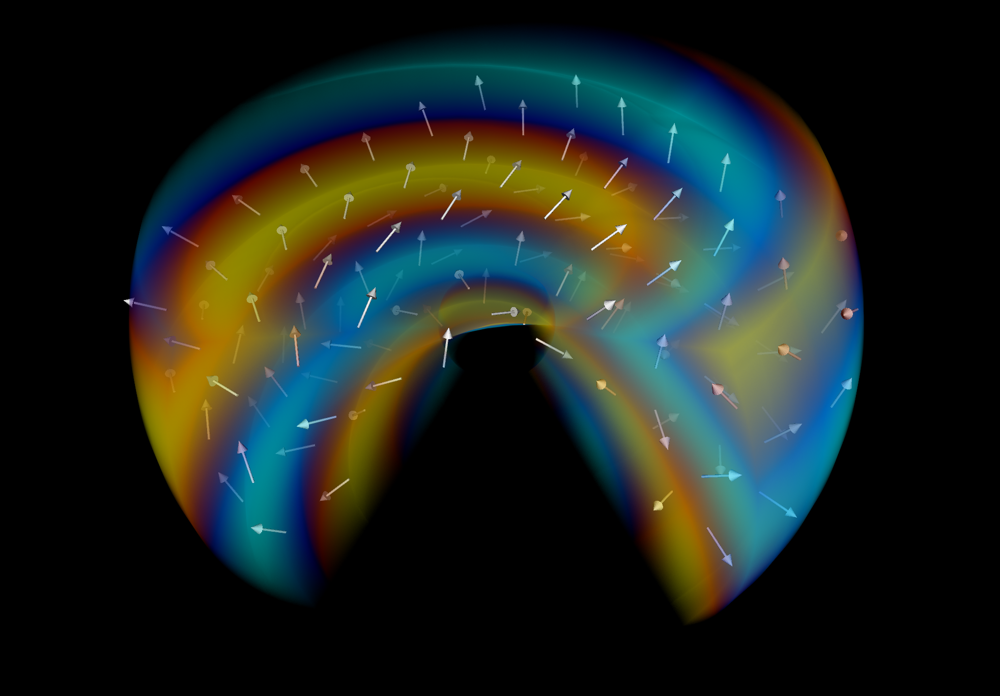

[](https://github.com/LRZ-BADW/DPEcho/blob/main/LICENSE) [](https://zenodo.org/badge/latestdoi/554711124) [](https://shields.io/)

# DPEcho: General Relativity in SYCL for the 2020s and beyond
Numerical sciences are experiencing a renaissance thanks to the spread of heterogeneous computing, which opens to simulations a quantitatively and qualitatively larger class of problems, albeit at the cost of large code refactoring efforts.
The SYCL open standard rewards such porting efforts with highly scalable results, widely portable as never before, and likely to stand the test of time.
SYCL unlocks the capabilities of GPGPUs, accelerators and multicore or vector CPUs, as well as advanced compiler features and technologies (LLVM, JIT), while offering intuitive C++ APIs for work-sharing and scheduling, and for directly mapping simulation domains into execution space.
The latter is especially convenient in numerical General Relativity (GR), a highly compute- and memory- intensive field where the properties of space and time are strictly coupled with the equations of motion.

We present DPEcho, a SYCL+MPI porting of the General-Relativity-Magneto-Hydrodynamic (GR-MHD) OpenMP+MPI code Echo, used to model instabilities, turbulence, propagation of waves, stellar winds and magnetospheres, and astrophysical processes around Black Holes.
It supports classic and relativistic MHD, both in Minkowski- or any coded GR metric.
DPEcho uses exclusively SYCL structures for memory and data management, and the flow control revolves entirely around critical device-code blocks, for which the key physics kernels were re-designed: most data reside almost permanently on the device, maximizing computational times.
As a result, on the core physics elements ported so far, the measured performance gain is above 4x on HPC CPU hardware, and of order 7x on commercial GPUs.



## Prerequisites

It is possible to compile echo with SYCL 2020-compatible compilers.
However, our main target so far was the **Intel oneAPI DPC++ Compiler**.
Nevertheless, with minor tweaks to the the CMake file, it is possible to use other implementations that support SYCL 2020.
So far, we successfully used:

* **[Intel oneAPI toolkit](https://www.intel.com/content/www/us/en/developer/tools/oneapi/overview.html)** (version >= 2023.0) targeting Intel CPUs and Intel GPUs. Using the **[Codeplay Plugins](https://codeplay.com/solutions/oneapi/)**, NVIDIA and AMD GPUs can also be targeted.
* **[Intel LLVM compiler](https://github.com/intel/llvm)** open Source project targeting Intel CPUs and NVIDIA and AMD GPUs.
* **[OpenSYCL](https://github.com/OpenSYCL/OpenSYCL)* - a SYCL implementation for CPUs and GPUs (functionality untested in DPEcho)*

Depending on the chosen compiler, DPEcho is capable of running on a wide variety of CPUs and GPUs.
It is possible to use compute devices only capable of working with single-precision floating point numbers, but for a sufficient accuracy with more complex scenarios, double precision support is likely necessary.

Further requirements:
* CMake (>= 3.13)
* VisIt for visualization of the output.

## Building

make sure that your SYCL compiler and CMake are in available in your environment.

Using cmake >= 3.13. E.g.

``` bash
mkdir -p build && cd build
cmake .. && make
```
Or ccmake:
``` bash
mkdir -p build && cd build && ccmake ..
make
```

Simulation parameters such as order of derivation, type of simulation (MHD or GR-MHD) or type of execution device may be edited in the CCMake command line UI.
Other parameters may be set at runtime.
An example parameter file is shown at [the example parameter file alfven.par](examples/alfven.par).
As a default behavior, DPEcho expects a parameter file called **echo.par** in its working directory.
The path to an alternative file may also be passed as a commandline argument.

## Known Issues

* NVIDIA GPUs report out of resources with automatic kernel invocations. Defaulting to manual workgroup size specification.
* AMD GPU support through OpenSYCL requires GPU-aware-MPI and must be configured for a specific architecture. E.g.:
```bash
CXX=$ROCM_PATH/llvm/bin/clang cmake -DSYCL=OpenSYCL -DSYCL_DEVICE=GPU -DSYCL_ARCH=AMD -DCMAKE_CXX_FLAGS="--offload-arch=gfx90a" ..
```

## References

* [Intel Parallel Universe Magazine](https://www.intel.com/content/www/us/en/developer/articles/technical/dpecho-general-relativity-sycl-for-2020-beyond.html#gs.pqrf25), Salvatore Cielo, Alexander Pöppl, Luca Del Zanna, Matteo Bugli - *DPEcho: General Relativity with SYCL for the 2020s and beyond*

## Authors
(in alphabetical order)
* Fabio Baruffa (former)
* Matteo Bugli
* **Salvatore Cielo**
* Luca Del Zanna
* Luigi Iapichino (former)
* **Alexander Pöppl**
